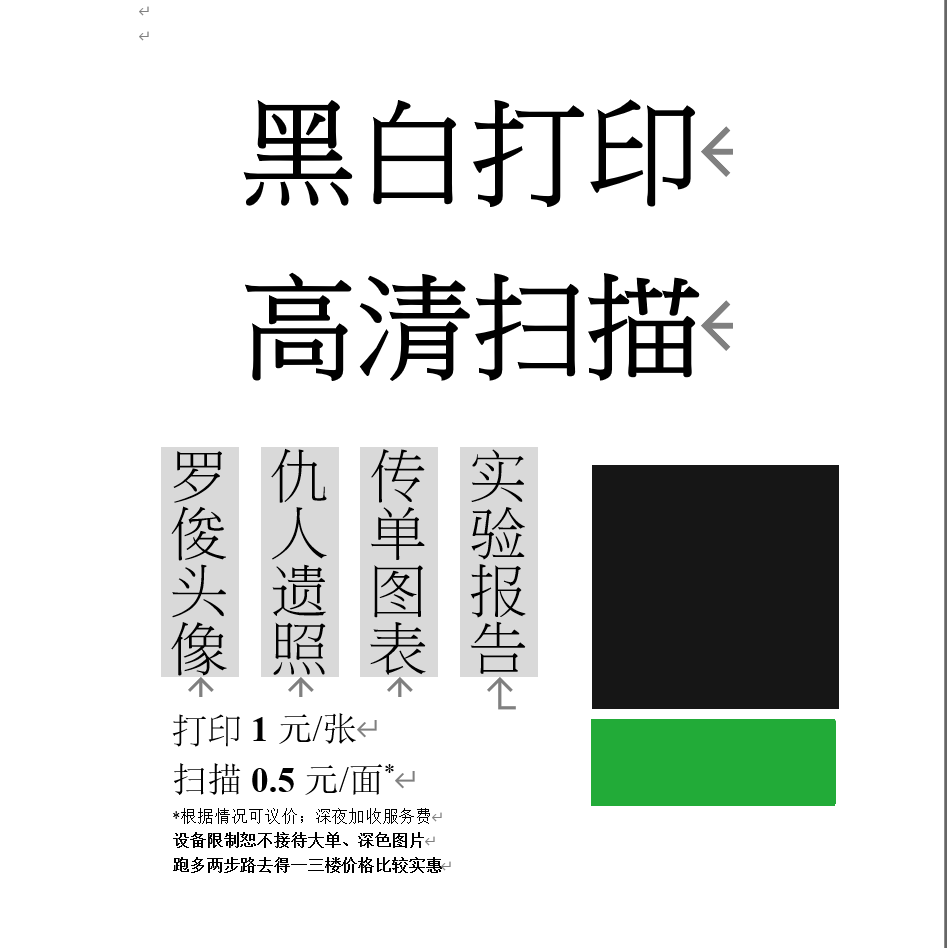

# PhyHub

Welcome to PhyHub! 

## We are ...
This is a platform for sudents in SPA of SYSU, discovering the possibility of a decentralized way to serve everyone about studying, life, etc. 

PhyHub is founded Aug. 31, 2018. Our core members have reached twelve, and many members left unsigned.

## We do ...

Our office in L8 have provide not only basic services like book hosting and accommodation, but also multiple additional applications like **printing**, **music party**, **physical training** and so on. 

Also, we have a pubic cloud [here](https://phyhub-sysu.github.io/PhyCloud/#). We might upload some textbook to it soon.

## Contact

* You can subscribe us at WeChat:

* [GitHub Organization](https://github.com/PhyHub-SYSU)

* A QQ Group for LaTeX doc sharing about experiment report: 780901953